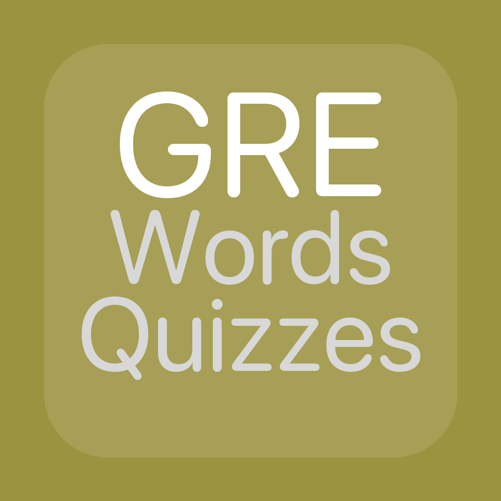
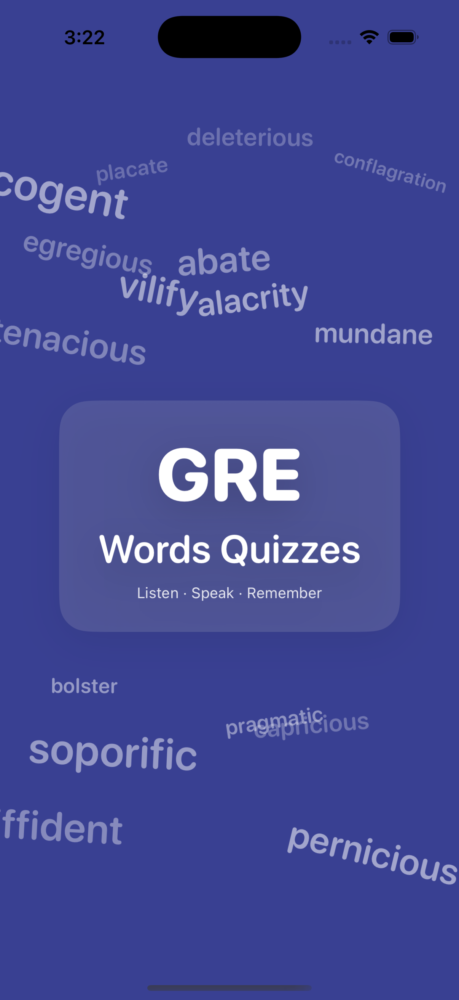
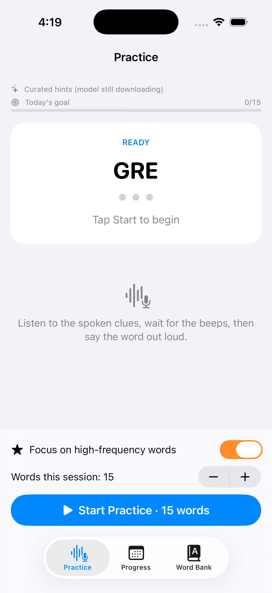
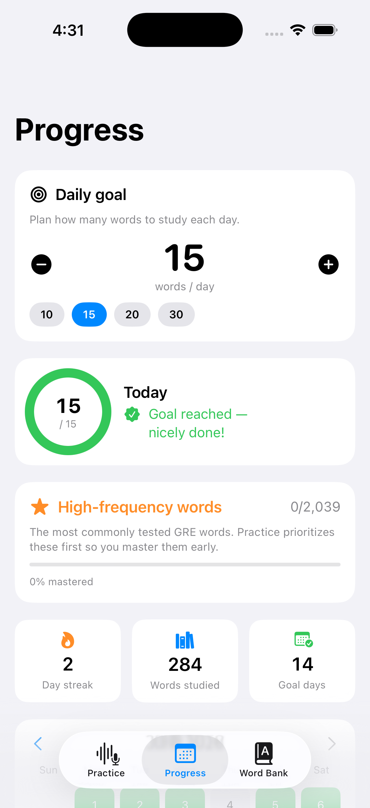
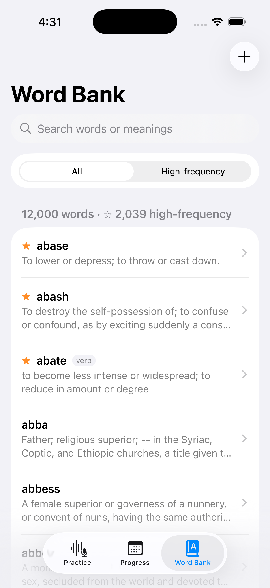

<div align="center">
  
  <h1>GRE Words Quizzes</h1>
  <p><strong>Learn GRE vocabulary by talking, not typing.</strong><br/>
  Listen · Speak · Remember</p>
</div>

A hands-free, voice-first iOS app for memorizing GRE vocabulary. The app speaks three
different clues for each word, plays a "beep-beep-beep" cue, then listens for your
spoken English answer and checks it with speech recognition — so you practice active
recall the way memory really works.

## ✨ Features

- **Voice-driven quizzes** — answer out loud; no typing required.
- **Multi-angle hints** for every word, mixed in randomly each round:
  - **Definition** — what the word means.
  - **Characteristics** — features, use, color, shape, or feeling.
  - **Synonym / antonym** — a close-in-meaning or opposite word (from WordNet),
    appearing when available.
  - **Spelling** — its first two letters, given last as a final nudge.
- **Adaptive flow** — silence advances to the next hint; an early wrong answer prompts
  *"Another chance, or finish?"* (answer by voice).
- **On-device hint generation** with Apple Intelligence (Foundation Models), with a
  curated offline fallback so it always works.
- **High-frequency focus** — ~2,000 of the most commonly tested GRE words (drawn from
  Magoosh, Barron's, Manhattan, GregMat, Powerscore, PrepScholar, Greenlight and more)
  are flagged and **practiced first**, with a mastery tracker in the Progress tab.
- **12,000-word local bank** with definitions, fully searchable and filterable by
  high-frequency; add your own words.
- **Daily goals & calendar tracking** — plan a daily word count (default 15) and grow
  your streak on a color-coded calendar.
- **Private by design** — no accounts, no ads, no third-party tracking; data stays on device.

## 📱 Screenshots

| Launch | Practice | Progress | Word Bank |
|:------:|:--------:|:--------:|:---------:|
|  |  |  |  |

## 🧰 Tech stack

- **SwiftUI** + **Core Data** (local persistence & seeding of the word bank)
- **AVFoundation** — text-to-speech narration and synthesized beep cues
- **Speech framework** — live English speech-to-text (on-device where supported)
- **Apple Intelligence / Foundation Models** — on-device hint generation
- Targets iOS 26+

## 🚀 Build & run

1. Open `GRE Words Quizzes.xcodeproj` in Xcode 26 or later.
2. Select an iPhone (or simulator) and run.
3. On first launch, allow **Microphone** and **Speech Recognition** to enable voice answers.
   (Voice capture requires a physical device; the Simulator can't record from a mic.)

## 🌐 Website (Help & Privacy)

The `docs/` folder contains a ready-to-publish website:

- `docs/index.html` — Help & features page (with screenshots)
- `docs/privacy.html` — Privacy Policy (App Store–ready)

### Publish with GitHub Pages
Push the repo, then in **Settings → Pages**, set the source to the `main` branch and the
`/docs` folder. Your pages will be served at:

```
https://<your-username>.github.io/<repo>/            → Help
https://<your-username>.github.io/<repo>/privacy.html → Privacy Policy
```

### Use with Google Sites
On Google Sites you can either:
- **Link** to the GitHub Pages URLs above from your site, or
- **Embed** a page using *Insert → Embed → By URL* (paste the GitHub Pages link), or
  *Insert → Embed → Embed code* (paste the contents of the HTML files).

> Before publishing, update the support email in `docs/privacy.html` (Section 13).

## 🔒 Privacy

The app collects no personal information, contains no ads or analytics, and stores your
word bank and progress locally on your device. Spoken answers are processed by Apple's
system speech recognition and are not recorded or sent to the developer. See the full
[Privacy Policy](docs/privacy.html).

## 📄 License

© 2026 Minghao Wang. All rights reserved.
#GREWordsQuizzes
